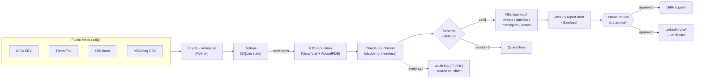
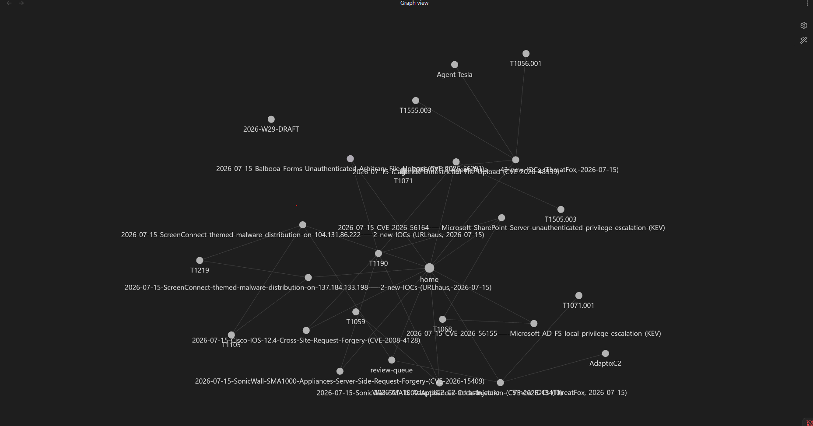

# Threat Intel Pipeline

An automated threat intelligence pipeline that ingests public threat feeds daily, uses
Claude (headless) to enrich each item into analyst-quality notes, stores everything as a
wikilinked knowledge graph in an Obsidian vault, and drafts a weekly analyst report that a
human reviews and approves before anything is published.

Built by an aspiring SOC analyst as a working exercise in threat intel triage: every design
decision optimizes for **honest, auditable analysis** — the pipeline is engineered so the
AI can say "I don't know" and a human is always the last gate before publication.

## Architecture



## What makes this different from a scraper + LLM

- **The AI is not trusted.** Every enrichment is validated against a strict schema
  (frontmatter fields, severity/confidence enums, ATT&CK ID format) before it can touch
  the vault; failures are quarantined, never published. See `pipeline/enrich.py`.
- **The AI's claims are checked against the world, not just a schema.** ATT&CK technique
  IDs are validated against a snapshot of the real ATT&CK catalog, so an invented but
  well-formed `T9999` is rejected rather than quietly becoming a stub page in the graph.
  `source` and `date` are cross-checked against the item they came from.
- **A no-guessing rule is enforced in the prompt contract.** If the source doesn't support
  a claim, the model must set `confidence: low` + `flagged: true` and say what's uncertain
  — flagged notes land in a review queue for a human. The rubric and rule live in
  [`skills/threat-analyst.md`](skills/threat-analyst.md).
- **Failures are visible, not silent.** A threat pipeline that quietly returns nothing is
  worse than one that crashes. abuse.ch reports a revoked API key as HTTP 200 with
  `query_status: illegal_auth_key`, which naive parsing reads as a quiet day — that is
  detected and raised. Feeds and items are isolated so one failure can't abandon the run,
  and the process exits non-zero when anything fails.
- **Full audit trail.** Every enrichment appends a JSONL record pairing the raw source
  snapshot with the model's exact output, so "what Claude claimed vs. what the source
  said" is always answerable.
- **Human-gated publishing.** Report drafts are gitignored; `pipeline/publish.py` requires
  an interactive confirmation, and LinkedIn posting is deliberately manual (draft to
  clipboard) — nothing reaches the public without a person deciding it should.
- **Volume-bounded by design.** IOC firehoses (ThreatFox/URLhaus) are aggregated per
  malware-family-per-day; enrichment is capped per run with carry-over, so the vault grows
  with signal, not noise.
- **Independent reputation context, from four angles.** Before enrichment each item is
  enriched with whatever applies to it, and the results are handed to the model as explicit
  context — so severity rests on multi-source evidence, not one feed's word:
  - **VirusTotal** — engine verdicts for a sample of the item's IOCs
  - **AbuseIPDB** — community abuse-report scores for IP IOCs
  - **GreyNoise** — whether an IP is mass-scanning the internet or is dedicated
    infrastructure. This is the question the others can't answer: a high abuse score on a
    known internet-wide scanner is noise, while a *quiet* IP is the more interesting one.
  - **EPSS** — probability that a CVE will be exploited in the next 30 days. It pairs with
    KEV without duplicating it: KEV says exploitation *has been observed*, EPSS says how
    likely it is. A KEV entry scoring 23% next to one scoring 99% is a prioritization
    signal, not a contradiction.

  Lookups are capped, paced across the whole run, cached for 7 days, and recorded in the
  audit log. A provider outage degrades the note rather than stopping the pipeline, and
  says so explicitly — the model must not read a failed lookup as a clean verdict. The
  prompt warns that "not found" ≠ benign (fresh C2 infrastructure is often unknown to
  scanners). See `pipeline/reputation.py` and its per-service modules. All keys are
  optional; EPSS needs none.

## What went wrong, and what it taught me

Keeping an honest record means writing up the pipeline's own failures, not just the
threats it catches.

A malformed RSS entry once produced an empty item. The model behaved exactly as the
prompt contract demands — it wrote "ingestion failure suspected" instead of inventing a
threat. **The pipeline then filed that notice into `vault/threats/` as a threat note and
recorded the item as seen**, because validation checked the note's *shape* and nothing
checked whether the item had any content to analyze. The note was quietly hand-deleted,
which the project's own rules forbid.

The lesson wasn't "the model can't be trusted" — it was that a guardrail on the model is
not a guardrail on the system around it. An ingestion failure is now caught before a
`claude` call is spent (`run.is_enrichable`), and the audit trail records every outcome,
including the failures, in a `finally`.

Building this also turned up that the test suite had been writing into the production
audit log for months — 12 of 25 records were pytest artifacts. They were removed by a
script that logs its own deletion, and `conftest.py` now makes it structurally impossible.

## The knowledge graph

Each threat note wikilinks the malware families, MITRE ATT&CK techniques, and threat
actors it references; stub pages are auto-created so Obsidian's graph view shows the real
relationships — which families use which techniques, which CVEs cluster where.

Every run also exports `vault/docs/attack-layer.json`, an
[ATT&CK Navigator](https://mitre-attack.github.io/attack-navigator/) layer scoring each
technique by how many notes cite it (Open Existing Layer → Upload from Local). It shows
observed activity, not ATT&CK coverage in the abstract — the only claim the data supports.



*Threat notes (the long dated titles) linked to the ATT&CK techniques and malware families
they cite. `T1190` sits at the centre of the KEV cluster; `Agent Tesla` and `AdaptixC2`
pull in their own techniques. Nothing here is hand-drawn — the edges are wikilinks the
enrichment wrote, and the stub pages were auto-created.*

## Setup

```powershell
git clone <this repo> && cd threat-intel-pipeline
python -m venv .venv; .\.venv\Scripts\Activate.ps1
pip install -r requirements.txt
copy .env.example .env          # add free API keys: abuse.ch, VirusTotal, AbuseIPDB (all optional)
python -m pipeline.run --source kev --limit 3   # first run, bounded
scripts\register_tasks.ps1      # daily 08:00 + Sunday 09:00 via Windows Task Scheduler
```

Requires [Claude Code](https://claude.com/claude-code) installed and logged in
(enrichment runs `claude -p` headless — no API key needed).

Weekly flow: Sunday's task drafts `vault/reports/drafts/YYYY-Wnn-DRAFT.md` → edit it →
`python -m pipeline.publish YYYY-Wnn` (interactive confirm → git push → LinkedIn draft on
clipboard).

## Tests

220+ unit tests (TDD) cover dedupe state, output validation (schema, ATT&CK catalog,
source/date cross-checks), note/stub/dashboard generation, feed parsers (including the
malformed-RSS regression and abuse.ch auth-failure envelopes), reputation lookups (rate
pacing, caching, 429 handling, URL identifiers, not-found handling), EPSS scoring, run
resilience, report drafting, and publish guards:

```
python -m pytest tests/ -q
```

CI runs the suite on **Windows and Linux**. Windows matters more here: the pipeline is
deployed on Windows via Task Scheduler with cp1252 stdout, so the encoding and reserved-
filename bugs the suite now covers were invisible to Linux-only CI.

## Sources

**Feeds**

- [CISA Known Exploited Vulnerabilities](https://www.cisa.gov/known-exploited-vulnerabilities-catalog)
- [abuse.ch ThreatFox](https://threatfox.abuse.ch/) / [URLhaus](https://urlhaus.abuse.ch/)
- [Malware-Traffic-Analysis.net](https://www.malware-traffic-analysis.net/)

**Enrichment**

- [FIRST EPSS](https://www.first.org/epss/) — exploitation probability (no API key)
- [VirusTotal](https://www.virustotal.com/) — engine verdicts
- [AbuseIPDB](https://www.abuseipdb.com/) — community abuse scores
- [GreyNoise Community](https://www.greynoise.io/) — scanner vs. targeted infrastructure
- [MITRE ATT&CK](https://attack.mitre.org/) — technique catalog (`python -m pipeline.attack --refresh`)
