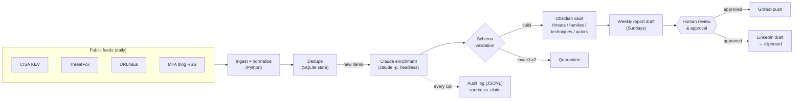

# Threat Intel Pipeline

An automated threat intelligence pipeline that ingests public threat feeds daily, uses
Claude (headless) to enrich each item into analyst-quality notes, stores everything as a
wikilinked knowledge graph in an Obsidian vault, and drafts a weekly analyst report that a
human reviews and approves before anything is published.

Built by an aspiring SOC analyst as a working exercise in threat intel triage: every design
decision optimizes for **honest, auditable analysis** — the pipeline is engineered so the
AI can say "I don't know" and a human is always the last gate before publication.

## Architecture



## What makes this different from a scraper + LLM

- **The AI is not trusted.** Every enrichment is validated against a strict schema
  (frontmatter fields, severity/confidence enums, ATT&CK ID format) before it can touch
  the vault; failures are quarantined, never published. See `pipeline/enrich.py`.
- **A no-guessing rule is enforced in the prompt contract.** If the source doesn't support
  a claim, the model must set `confidence: low` + `flagged: true` and say what's uncertain
  — flagged notes land in a review queue for a human. The rubric and rule live in
  [`skills/threat-analyst.md`](skills/threat-analyst.md). (It has already caught a real
  incident: a malformed RSS feed produced an empty item, and the model correctly wrote
  "ingestion failure suspected" instead of inventing a threat.)
- **Full audit trail.** Every enrichment appends a JSONL record pairing the raw source
  snapshot with the model's exact output, so "what Claude claimed vs. what the source
  said" is always answerable.
- **Human-gated publishing.** Report drafts are gitignored; `pipeline/publish.py` requires
  an interactive confirmation, and LinkedIn posting is deliberately manual (draft to
  clipboard) — nothing reaches the public without a person deciding it should.
- **Volume-bounded by design.** IOC firehoses (ThreatFox/URLhaus) are aggregated per
  malware-family-per-day; enrichment is capped per run with carry-over, so the vault grows
  with signal, not noise.

## The knowledge graph

Each threat note wikilinks the malware families, MITRE ATT&CK techniques, and threat
actors it references; stub pages are auto-created so Obsidian's graph view shows the real
relationships — which families use which techniques, which CVEs cluster where.

## Setup

```powershell
git clone <this repo> && cd threat-intel-pipeline
python -m venv .venv; .\.venv\Scripts\Activate.ps1
pip install -r requirements.txt
copy .env.example .env          # add your free abuse.ch Auth-Key (optional; KEV+RSS work without)
python -m pipeline.run --source kev --limit 3   # first run, bounded
scripts\register_tasks.ps1      # daily 08:00 + Sunday 09:00 via Windows Task Scheduler
```

Requires [Claude Code](https://claude.com/claude-code) installed and logged in
(enrichment runs `claude -p` headless — no API key needed).

Weekly flow: Sunday's task drafts `vault/reports/drafts/YYYY-Wnn-DRAFT.md` → edit it →
`python -m pipeline.publish YYYY-Wnn` (interactive confirm → git push → LinkedIn draft on
clipboard).

## Tests

40+ unit tests (TDD) cover dedupe state, output validation, note/stub/dashboard
generation, feed parsers (including the malformed-RSS regression), report drafting, and
publish guards:

```
python -m pytest tests/ -q
```

## Sources

- [CISA Known Exploited Vulnerabilities](https://www.cisa.gov/known-exploited-vulnerabilities-catalog)
- [abuse.ch ThreatFox](https://threatfox.abuse.ch/) / [URLhaus](https://urlhaus.abuse.ch/)
- [Malware-Traffic-Analysis.net](https://www.malware-traffic-analysis.net/)
